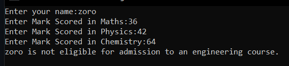
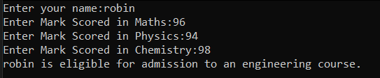

# Ex:1  Eligibility-for-Admission

## Aim:
To write C# program to find the eligibility for admission to an engineering course.

## Algorithnm:
### Step 1:
Create new class
### Step 2: 
Initiate the variables for maths, physics and chemistry and get the value from the user.
### Step 3:
Check for the given criteria for eligibility using if-else statements.
### Step 4:
Display whether the person is eligible for admission or not based on the given criteria. 

## Program:
```
/*
Program to check the eligibility for admission to an engineering course.
Developed by: Senthil Kumar S
RegisterNumber:  212221230091
*/
```
```c#
using System;
using System.Collections.Generic;
using System.Linq;
using System.Text;
using System.Threading.Tasks;

namespace exp1
{
    class Program
    {
        static void Main(string[] args)
        {
            string name;
            int maths, physics, chemistry;
            Console.Write("Enter your name:");
            name = Console.ReadLine();
            Console.Write("Enter Mark Scored in Maths:");
            maths = Convert.ToInt32(Console.ReadLine());
            Console.Write("Enter Mark Scored in Physics:");
            physics = Convert.ToInt32(Console.ReadLine());
            Console.Write("Enter Mark Scored in Chemistry:");
            chemistry = Convert.ToInt32(Console.ReadLine());
            int Total_Sum = maths + physics + chemistry;
            int Math_Phy_Tot = maths + physics;
            if(maths>=65 && physics>=55 && chemistry >= 50)
            {
                if(Total_Sum>=180 || Math_Phy_Tot >= 140)
                {
                    Console.WriteLine(name + " is eligible for admission to an engineering course.");
                }
                else
                {
                    Console.WriteLine(name + " is not eligible for admission to an engineering course.");
                }
            }
            else
            {
                Console.WriteLine(name + " is not eligible for admission to an engineering course.");
            }
        }
    }
}
```
## Output:



## Result:
A C# program to check the eligibility for admission to an engineering course has been successfully executed.
